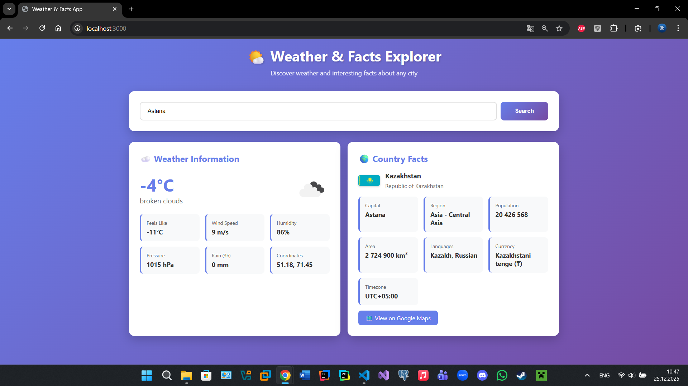
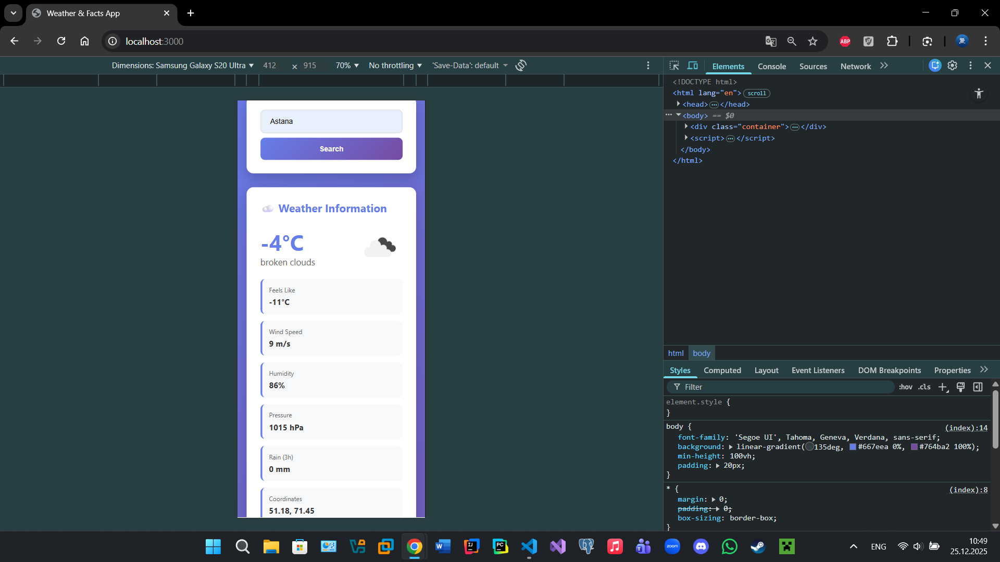
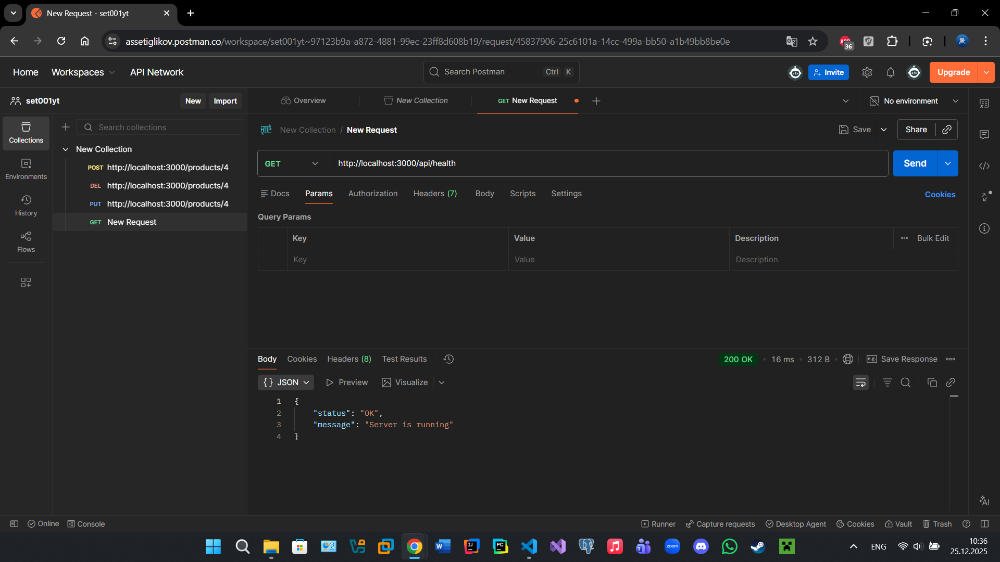

# Assignment 2: Backend API Integration & Service Development

Backend API application that integrates OpenWeather API and REST Countries API to provide weather information and country facts for any city.

## 📋 Project Description

This application demonstrates backend API integration and service development. It retrieves real-time weather data and country facts through server-side API calls, ensuring secure handling of API keys and providing a clean, responsive user interface.

## 🚀 Technologies Used

- **Backend:** Node.js, Express.js
- **HTTP Client:** Axios
- **Environment Management:** dotenv
- **CORS:** cors middleware
- **APIs:**
  - OpenWeather API (Weather data)
  - REST Countries API (Country facts)

## 📦 Project Structure

```
weather-facts-api/
├── server.js              # Main server file with API endpoints
├── public/
│   └── index.html         # Frontend user interface
├── package.json           # Dependencies and scripts
├── .env                   # Environment variables (NOT in repo)
├── .env.example           # Environment template
├── .gitignore            # Git ignore rules
└── README.md             # This file
```

## ⚙️ Installation & Setup

### Prerequisites
- Node.js (v14 or higher)
- npm or yarn
- OpenWeather API key

### Step-by-Step Installation

1. **Clone the repository:**
```bash
git clone <your-repo-url>
cd weather-facts-api
```

2. **Install dependencies:**
```bash
npm install
```

3. **Set up environment variables:**
```bash
# Copy the example file
cp .env.example .env
```

Then edit the `.env` file and add your actual API key.

4. **Get your OpenWeather API key:**
   - Visit https://openweathermap.org/api
   - Sign up for a free account
   - Generate an API key
   - Paste it in your `.env` file

5. **Start the server:**
```bash
# Development mode (with auto-restart)
npm run dev

# Production mode
npm start
```

6. **Open in browser:**
```
http://localhost:3000
```

## 🔌 API Endpoints

### 1. Health Check
**Endpoint:** `GET /api/health`

**Description:** Check if server is running

**Example:**
```bash
GET http://localhost:3000/api/health
```

**Response:**
```json
{
  "status": "OK",
  "message": "Server is running"
}
```

---

### 2. Weather Data
**Endpoint:** `GET /api/weather?city={cityName}`

**Description:** Get weather information for a specific city

**Parameters:**
- `city` (required): Name of the city

**Example:**
```bash
GET http://localhost:3000/api/weather?city=Astana
```

**Response:**
```json
{
  "city": "Astana",
  "temperature": -15.5,
  "description": "clear sky",
  "icon": "01d",
  "coordinates": {
    "lat": 51.1694,
    "lon": 71.4491
  },
  "feelsLike": -20.3,
  "windSpeed": 5.2,
  "countryCode": "KZ",
  "rain": 0,
  "humidity": 65,
  "pressure": 1015
}
```

---

### 3. Country Facts
**Endpoint:** `GET /api/facts?country={countryCode}`

**Description:** Get facts about a country using ISO country code

**Parameters:**
- `country` (required): ISO 3166-1 alpha-2 country code (e.g., US, KZ, GB)

**Example:**
```bash
GET http://localhost:3000/api/facts?country=KZ
```

**Response:**
```json
{
  "name": "Kazakhstan",
  "officialName": "Republic of Kazakhstan",
  "capital": "Astana",
  "region": "Asia",
  "subregion": "Central Asia",
  "population": "19,000,000",
  "area": "2,724,900 km²",
  "languages": "Kazakh, Russian",
  "currencies": "Kazakhstani tenge (₸)",
  "timezone": "UTC+05:00",
  "flag": "https://flagcdn.com/w320/kz.png",
  "coatOfArms": "https://mainfacts.com/media/images/coats_of_arms/kz.png",
  "maps": "https://goo.gl/maps/..."
}
```

---

### 4. Combined Weather & Facts
**Endpoint:** `GET /api/weather-facts?city={cityName}`

**Description:** Get both weather and country facts in a single request

**Parameters:**
- `city` (required): Name of the city

**Example:**
```bash
GET http://localhost:3000/api/weather-facts?city=London
```

**Response:**
```json
{
  "weather": {
    "city": "London",
    "temperature": 12.5,
    "description": "light rain",
    "icon": "10d",
    "coordinates": { "lat": 51.5074, "lon": -0.1278 },
    "feelsLike": 10.2,
    "windSpeed": 4.5,
    "countryCode": "GB",
    "rain": 0.5,
    "humidity": 80,
    "pressure": 1012
  },
  "facts": {
    "name": "United Kingdom",
    "officialName": "United Kingdom of Great Britain and Northern Ireland",
    "capital": "London",
    "region": "Europe",
    "subregion": "Northern Europe",
    "population": "67,215,293",
    "area": "242,900 km²",
    "languages": "English",
    "currencies": "British pound (£)",
    "timezone": "UTC",
    "flag": "https://flagcdn.com/w320/gb.png",
    "maps": "https://goo.gl/maps/..."
  }
}
```

---

## 🧪 Testing with Postman

### Import Collection Steps:

1. Open Postman
2. Create a new request
3. Test each endpoint:

**Example 1: Weather Data**
```
Method: GET
URL: http://localhost:3000/api/weather?city=Astana
```

**Example 2: Country Facts**
```
Method: GET
URL: http://localhost:3000/api/facts?country=KZ
```

**Example 3: Combined Data**
```
Method: GET
URL: http://localhost:3000/api/weather-facts?city=Tokyo
```

### Expected Status Codes:
- `200` - Success
- `400` - Bad Request (missing parameters)
- `404` - Not Found (city/country not found)
- `500` - Server Error

---

## 🎨 Key Design Decisions

### Backend Architecture

1. **Server-Side API Calls**
   - All external API requests are made from the server
   - API keys are never exposed to the client
   - Provides an abstraction layer for data processing

2. **RESTful Design**
   - Clear, descriptive endpoints
   - Proper HTTP methods and status codes
   - JSON response format

3. **Error Handling**
   - Try-catch blocks for all API calls
   - Meaningful error messages returned to client
   - Different status codes for different error types

4. **Data Transformation**
   - Raw API data is cleaned and formatted
   - Only necessary fields are returned
   - Consistent response structure

### Security

1. **Environment Variables**
   - API keys stored in `.env` file
   - `.env` excluded from Git via `.gitignore`
   - `.env.example` provided as template

2. **CORS Configuration**
   - CORS middleware enabled for cross-origin requests
   - Can be restricted to specific domains in production

### Frontend Design

1. **Responsive Layout**
   - CSS Grid for flexible card layout
   - Media queries for mobile devices
   - Responsive form inputs

2. **User Experience**
   - Loading indicators during API calls
   - Clear error messages
   - Smooth animations and transitions
   - Weather icons from OpenWeather

3. **Visual Design**
   - Modern gradient background
   - Card-based layout
   - Clean typography
   - Color-coded information sections

---

## 📸 Screenshots

### Desktop View

*Weather and country facts displayed side by side*

### Mobile View

*Responsive design adapts to smaller screens*

### Postman Testing

*API endpoint testing in Postman*

---

## 🔐 Security Notes

- **Never commit `.env` file** - Contains sensitive API keys
- **Use `.gitignore`** - Prevents accidental commits
- **Provide `.env.example`** - Template for other developers
- **Server-side only** - All API calls happen on backend

---

## 📝 API Usage Details

### OpenWeather API
- **Documentation:** https://openweathermap.org/api
- **Rate Limit:** 1,000 calls/day (free tier)
- **Units:** Metric (Celsius, m/s)
- **Required Fields Retrieved:**
  - Temperature
  - Description
  - Coordinates
  - Feels-like temperature
  - Wind speed
  - Country code
  - Rain volume (3h)

### REST Countries API
- **Documentation:** https://restcountries.com/
- **No API key required**
- **Rate Limit:** None (open API)
- **Data Retrieved:**
  - Country name and official name
  - Capital city
  - Population and area
  - Languages and currencies
  - Flag and maps

---

## 🚧 Troubleshooting

### "Cannot GET /api/weather" Error
- Ensure server is running (`npm start`)
- Check if PORT is available (default 3000)

### "Invalid API Key" Error
- Verify your OpenWeather API key in `.env`
- Check if key is activated (can take 10 minutes)

### "City not found" Error
- Check spelling of city name
- Try with English city names

### CORS Errors
- Make sure CORS middleware is enabled in server.js
- Check browser console for details

---

## 📚 Dependencies

```json
{
  "express": "^4.18.2",      // Web framework
  "axios": "^1.6.2",         // HTTP client
  "dotenv": "^16.3.1",       // Environment variables
  "cors": "^2.8.5"           // CORS middleware
}
```

### Dev Dependencies
```json
{
  "nodemon": "^3.0.2"        // Auto-restart server
}
```

---

## 👨‍💻 Author

Name: Asset Iglikov

Group: SE-2434

Course name: WEB Technologies 2 (Back End) | Samat Tankeyev

University/college: Astana IT University(AITU)

# 📄 License

ISC

---

## 🙏 Acknowledgments

- OpenWeather API for weather data
- REST Countries API for country information
- Express.js team for the excellent framework
